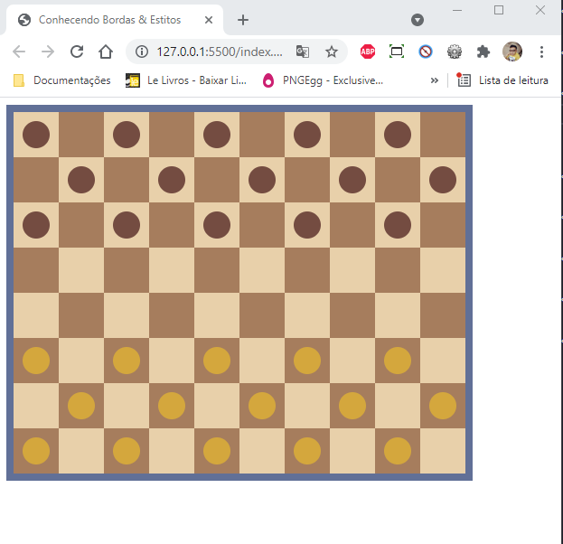

<h1>Projeto Jogo de Damas 💻😉</h1>

<a href="https://araujoleonardo310.github.io/jogo-de-damas/">🔗Clieque aqui!</a>

## Sobre

> Este é um projeto de **desafio** :cartwheeling: e **inspiração** 🤩 para recriar o Jogo de damas com  **HTML** e **CSS**.

## Status ✌️

### Projeto concluído 🚀

## Recursos & Ferramentas 

* Git 
* Github 
* Visual Studio Code 
* Html 
* CSS
* Seletor de cores de imagens online

## O quê aprendi 🧑‍💻

* Posicionamento de elementos
* Sequência e lógica das linhas
* Análise e captura de cores da imagem refência
* Noções de espaçamento de elementos
* Noções de alinhamento de elementos
* Noções de distanciamento entre elementos

## 🐧🖖 Créditos & 🔗 Refências 

[Wikipédia: Damas](https://pt.wikipedia.org/wiki/Damas)
[Imagem refência de construção do projeto](https://pt.wikipedia.org/wiki/Damas#/media/Ficheiro:International_draughts.jpg)
[IMAGECOLORPICKER.com](https://imagecolorpicker.com/pt-pt)

## Autor do projeto 👊

### Leonardo Araújo  
**Universiário 🧑‍🎓 de Sistemas de Informação 💻**

***"Se você tiver disposição de aprender e tentar então, seu sucesso está definido! ✨"*** 

